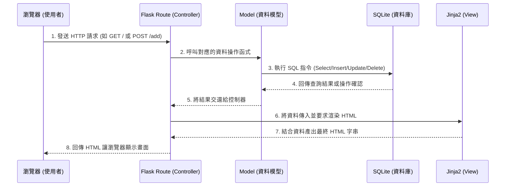

# 系統架構設計文件 (Architecture) - 任務管理系統

## 1. 技術架構說明

本專案採用輕量級的 Python Web 框架與關聯式資料庫，適合快速開發、部署與個人日常使用。

### 選用技術與原因
- **後端框架：Python + Flask**
  - **原因**：Flask 是輕巧且極具彈性的 Web 框架，學習曲線平緩，非常適合用來快速開發中小型應用程式與 MVP（最小可行性產品）。
- **模板引擎：Jinja2**
  - **原因**：Jinja2 是 Flask 內建支援的模板引擎，能直接在 HTML 中嵌入 Python 變數與邏輯（如迴圈、條件判斷），實現動態網頁內容，不須再額外處理複雜的前後端 API 串接。
- **資料庫：SQLite**
  - **原因**：作為一個檔案型資料庫，SQLite 不需要繁瑣的伺服器架設與設定，非常適合「任務管理系統」這類資料量不會太龐大的個人應用，備份與轉移也非常方便。

### Flask MVC 模式說明
本專案參考 MVC（Model-View-Controller）的設計概念來組織程式碼：
- **Model (資料模型)**：負責定義資料的結構（例如任務的標題、狀態、到期日），並處理與 SQLite 資料庫的讀取與寫入操作。
- **View (視圖)**：負責呈現使用者介面。在此由 **Jinja2 HTML 模板** 與靜態資源（CSS 樣式）負責呈現資料給使用者。
- **Controller (控制器)**：由 **Flask 路由 (Routes)** 擔任。負責接收來自瀏覽器的操作請求（如：點擊新增按鈕），調用對應的 Model 處理資料，最後將結果丟給 View 去渲染新的畫面。

## 2. 專案資料夾結構

為了保持程式碼整潔與高可維護性，專案採用以下結構：

```text
web_app_development/
├── app.py                # 應用程式主入口，負責初始化 Flask 實例並啟動伺服器
├── app/                  # 應用程式核心目錄
│   ├── models/           # 放置資料庫模型與操作邏輯
│   │   └── task.py       # 負責對 task 資料表進行 CRUD 處理
│   ├── routes/           # 放置路由處理邏輯 (Controller)
│   │   └── task_routes.py# 處理各項任務功能的路由 (如 /add, /edit)
│   ├── templates/        # 放置 Jinja2 模板檔 (View)
│   │   ├── base.html     # 網頁共同版面 (Header, 引入 CSS 等)
│   │   └── index.html    # 首頁與任務列表畫面
│   └── static/           # 放置靜態資源檔案
│       ├── css/          # 樣式表
│       │   └── style.css
│       └── js/           # 客製化腳本 (如需前端互動)
├── instance/             # 放置不需要進入版本控制的系統與私有檔案
│   └── database.db       # SQLite 資料庫檔案
└── docs/                 # 專案文件
    ├── PRD.md            # 產品需求文件
    └── ARCHITECTURE.md   # 系統架構設計文件 (本文件)
```

## 3. 元件關係圖

以下圖解展示了當使用者操作系統時，內部元件的互動流程：



## 4. 關鍵設計決策

1. **採用伺服器端渲染 (Server-Side Rendering, SSR)**
   - **原因**：為了加速開發流程，選擇將邏輯保留在伺服器端。不採用時下流行的前後端分離（如 React + API），可減少跨域問題 (CORS) 以及繁瑣的 API 規格定義，讓初學者能專注於功能實作。
2. **依照功能與職責拆分檔案**
   - **原因**：雖然小型專案常會將所有程式碼寫在 `app.py` 中，但我們選擇一開始就分離 `models` 與 `routes` 資料夾。這種模組化設計能提升程式可讀性，未來如果需要擴充「使用者註冊」等功能也更容易維護。
3. **集中管理 SQLite 資料庫於 `instance` 資料夾**
   - **原因**：在 Flask 中，`instance` 目錄的用途是存放不想被發布或公開的檔案。將 `database.db` 置於此並加入 `.gitignore` 忽略清單，可以保護個人的真實任務資料不被上傳到公開的 GitHub 倉庫中。
4. **透過 Base Template 共用版面**
   - **原因**：使用 Jinja2 的 `` 機制，可以將網站的 `<head>`、導覽列、底部版權宣告統一管理。這樣未來新增其他頁面（如獨立的編輯頁面）時，就不需要重複撰寫 HTML 骨架。
