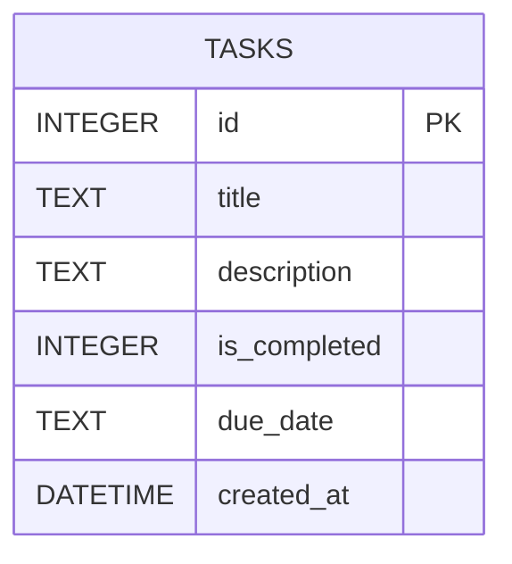

# 資料庫設計文件 (DB Design) - 任務管理系統

## 1. ER 圖 (實體關係圖)

本專案為單機版任務管理系統，目前僅需一個主要資料表即可滿足所有需求。

## 2. 資料表詳細說明

### `tasks` 資料表
用於儲存系統中所有的待辦任務紀錄。

| 欄位名稱 | 型別 | 必填 | 預設值 | 說明 |
|----------|------|------|--------|------|
| `id` | INTEGER | 是 | (Auto Increment) | 任務的唯一識別碼 (Primary Key) |
| `title` | TEXT | 是 | 無 | 任務的標題 |
| `description` | TEXT | 否 | NULL | 任務的詳細描述 |
| `is_completed` | INTEGER | 是 | 0 | 任務狀態，0 代表未完成，1 代表已完成 |
| `due_date` | TEXT | 否 | NULL | 任務的到期日 (建議格式：YYYY-MM-DD HH:MM 或 YYYY-MM-DD) |
| `created_at` | DATETIME | 是 | CURRENT_TIMESTAMP | 任務建立的時間戳記 |

## 3. SQL 建表語法
完整的 `CREATE TABLE` 語法已儲存於 `database/schema.sql` 中。

## 4. Python Model 程式碼
對應的 Python 操作邏輯（CRUD）已實作於 `app/models/task.py`，採用輕量級的 `sqlite3` 模組直接與資料庫互動，避免過度設計。
