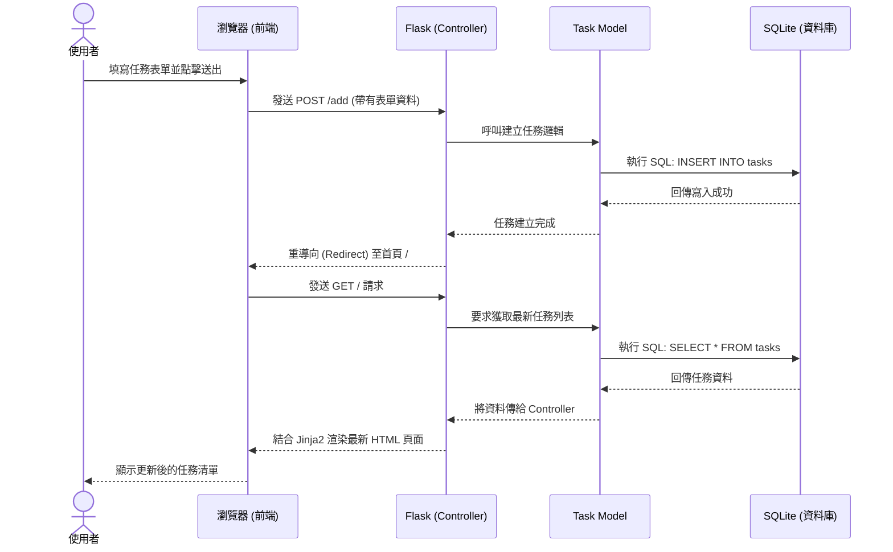

# 流程圖設計 (Flowchart) - 任務管理系統

## 1. 使用者流程圖 (User Flow)

此流程圖展示了使用者在系統中可進行的主要操作與畫面跳轉路徑：

```mermaid
flowchart LR
    Start([使用者開啟網頁]) --> Home[首頁 - 任務列表]
    
    Home --> Action{要執行什麼操作？}
    
    Action -->|新增任務| AddForm[填寫表單\n(標題、描述、到期日)]
    AddForm -->|送出| SaveNew[儲存至資料庫]
    SaveNew --> Home
    
    Action -->|編輯任務| EditForm[進入編輯頁面\n修改內容]
    EditForm -->|送出| SaveEdit[更新至資料庫]
    SaveEdit --> Home
    
    Action -->|刪除任務| ConfirmDel{確認刪除？}
    ConfirmDel -->|是| DelTask[自資料庫移除]
    DelTask --> Home
    ConfirmDel -->|否| Home
    
    Action -->|切換狀態| ToggleStatus[標記為完成/未完成]
    ToggleStatus --> Home
```

## 2. 系統序列圖 (Sequence Diagram)

此序列圖以「新增任務」為例，展示了前端瀏覽器、後端 Flask 與資料庫之間的完整資料交換過程：



## 3. 功能清單與路由對照表

以下為統整各項功能對應的 URL 設計與 HTTP 請求方法：

| 功能名稱 | 詳細說明 | HTTP 方法 | URL 路徑 |
|---------|----------|-----------|----------|
| 任務列表 | 首頁，負責顯示所有任務清單 | GET | `/` |
| 新增任務 | 接收表單並建立新任務 | POST | `/add` |
| 編輯頁面 | 顯示特定任務的修改表單 | GET | `/edit/<int:id>` |
| 更新任務 | 接收編輯表單的修改內容 | POST | `/edit/<int:id>` |
| 刪除任務 | 移除特定任務 | POST | `/delete/<int:id>` |
| 切換狀態 | 標記特定任務為已完成或未完成 | POST | `/toggle_status/<int:id>` |

*(註：為了簡化架構，刪除與切換狀態我們採用 POST 方法透過表單送出，以符合 HTML 標準與瀏覽器行為，避免直接使用 GET 產生副作用。)*
